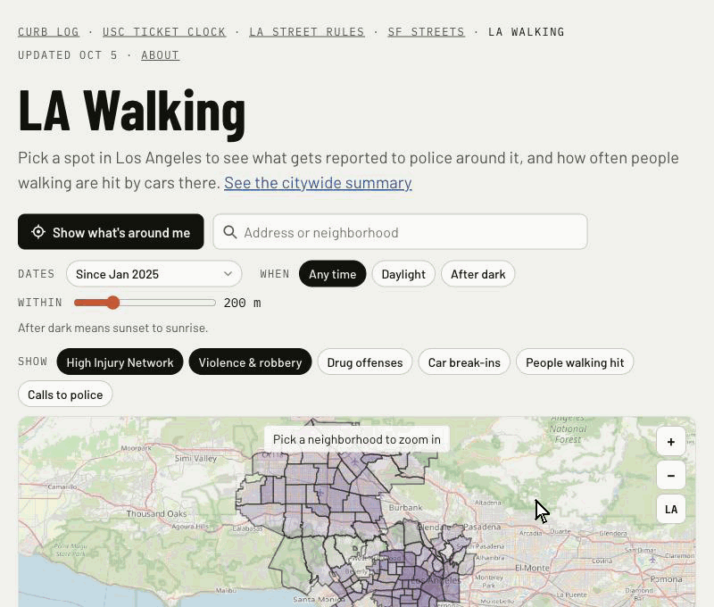

# LA Walking

**[LA Walking](https://citina.github.io/la-walking/)** is a map of the City of Los Angeles for people on foot. Pick a spot on the map, an address or where you are, and a distance
(100 to 500 m). The page shows what gets reported to police around it, what people call police about nearby, and how
often people walking have been hit by cars there, when and why. It also shows the High Injury Network streets, LA's list
of the streets where people are most often killed or badly hurt.

The sister page to the walking side of [SF Streets](https://citina.github.io/sf-streets/) ([sf-streets](https://github.com/citina/sf-streets)),
and built the same way as [LA Street Rules](https://citina.github.io/la-streets/streets/)
([la-streets](https://github.com/citina/la-streets)): one hand-written page, no map library, data split into small
map cells, rebuilt weekly. All from public data: LAPD on [data.lacity.org](https://data.lacity.org), California's crash
reports on [data.ca.gov](https://data.ca.gov), and LADOT's High Injury Network.


*6801 W Hollywood Blvd, in Hollywood: 240 police reports and 7 people walking hit within 200 m since January 2025. Below
the map, a summary of the whole city: most people walking who were killed by cars were hit after dark.*

See [PLAN.md](PLAN.md) for how it works and the decisions behind it, and [DATA_SOURCES.md](DATA_SOURCES.md) for which
dataset is used for what and which were left out.

Working title; the name is still open (PLAN.md §6).

## Run it

```
python3 fetch_la.py      # LA GeoHub, data.lacity.org and data.ca.gov -> data/raw/ (the street centerlines, about
                         # 76 MB; LAPD's reports and calls since 2025, about 50 MB; the High Injury Network, the
                         # reporting districts and the state's crash reports, about 8 MB; a few minutes the first time)
python3 analyze_la.py    # data/raw/ -> docs/data/ (about 35 seconds)
python3 -m http.server 8766 --directory docs
```

then open http://localhost:8766/. Python 3.9 or later, no packages beyond the standard library.

On GitHub, `.github/workflows/weekly.yml` does the same every Monday and publishes docs/data/ as the `la-data` release
(it isn't committed); `pages.yml` puts that release into docs/data/ and deploys the page.

## Who made this

Made by [Citina Liang](https://github.com/citina), a PhD candidate in Industrial & Systems Engineering at USC Viterbi who
models how people behave and how diseases spread, with Claude Code, from first commit (27 Sep 2026) to a published
page on 30 Sep 2026.
